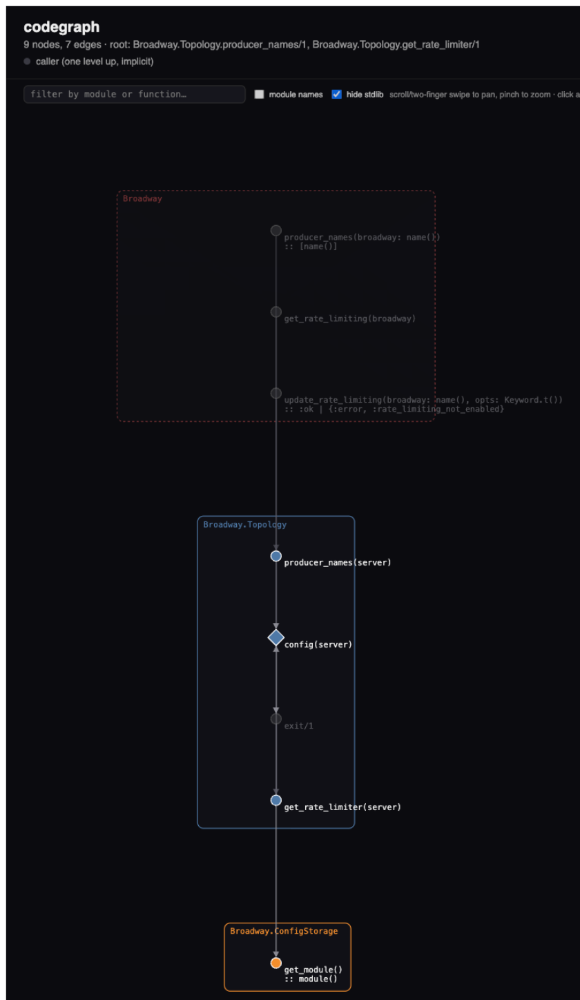
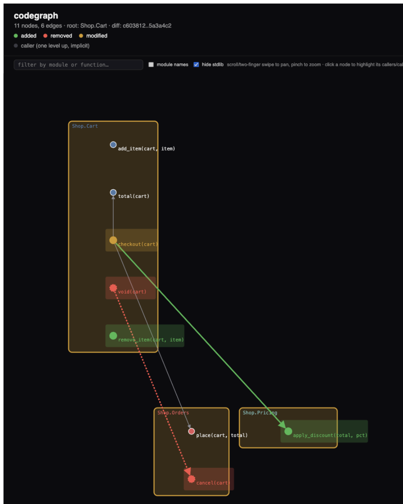

# Codegraph

**TODO: Add description**

## Screenshots

Modules render as color-coded boxes, functions as nodes inside them —
a circle for a public `def`, a diamond for a private `defp` — connected
by call edges. External calls (including a root's own immediate
callers, shown dashed above it) are drawn as boundary leaves without
being expanded further:



`--diff BASE..HEAD` renders the same graph reconciled between two git
refs, color-coding what changed — green for added, red for removed,
amber for a function whose body changed, and the default color for
anything unchanged:



## Usage

```
mix codegraph [--port 4444] [--path lib] [--root Module|Module.fun/arity] \
  [--fdepth 2] [--mdepth infinity] [--diff BASE_REF..HEAD_REF]
```

- `--port` — HTTP port for the web UI (default `4444`).
- `--path` — directory to scan for `.ex` files, relative to the project root (default `lib`). May also be absolute, or a relative path that escapes the project, to graph another package's source in place. Scanned recursively, but `deps/` and `_build/` are always excluded even if they fall under `--path`.
- `--root` — seed the graph from a module (`MyApp.Accounts`) or a specific function (`MyApp.Accounts.create_user/1`); repeatable. Omit to render the whole project graph.
- `--fdepth` — function-call hops from the root(s); integer or `infinity` (default `2`).
- `--mdepth` — distinct modules crossed on a path; integer or `infinity` (default `infinity`).
- `--diff` — render the diff between two git refs (e.g. `main..HEAD`) instead of the working tree; requires `--path` to stay relative and inside the current git repo.

## Installation

If [available in Hex](https://hex.pm/docs/publish), the package can be installed
by adding `codegraph` to your list of dependencies in `mix.exs`:

```elixir
def deps do
  [
    {:codegraph, "~> 0.1.0"}
  ]
end
```

Documentation can be generated with [ExDoc](https://github.com/elixir-lang/ex_doc)
and published on [HexDocs](https://hexdocs.pm). Once published, the docs can
be found at <https://hexdocs.pm/codegraph>.

